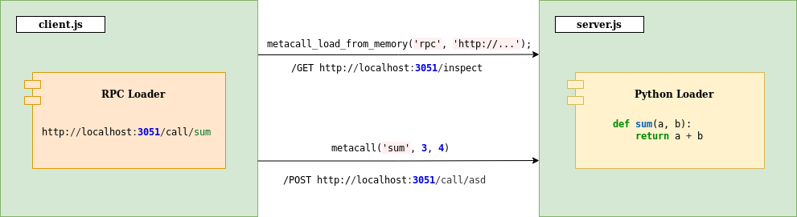

# [MetaCall](https://github.com/metacall/core/) Express FaaS RPC Example

An example of building a FaaS server with NodeJS and Express, with a client based on RPC Loader.



This example shows how to implement a server offering FaaS facilities by using MetaCall with NodeJS, the RPC calls from client look like normal function calls.

## Run it

1) Install MetaCall:
    ```sh
    curl -sL https://raw.githubusercontent.com/metacall/install/master/install.sh | sh
    ```

2) Install dependencies:
    ```sh
    metacall npm install
    ```

3) In a terminal, run:
    ```sh
    $ metacall
    λ load node server.js
    ```

4) In another terminal, run:
    ```sh
    metacall client.js
    ```
    Or optionally, with CURL:
    ```sh
    curl -X POST -H 'Content-type: application/json' http://localhost:3051/call/sum --data '[3, 4]'
    curl -X POST -H 'Content-type: application/json' http://localhost:3051/call/mult --data '[2, 3]'
    ```

5) In order to close it, in the server terminal write:
    ```sh
    λ call close()
    λ exit
    ```
